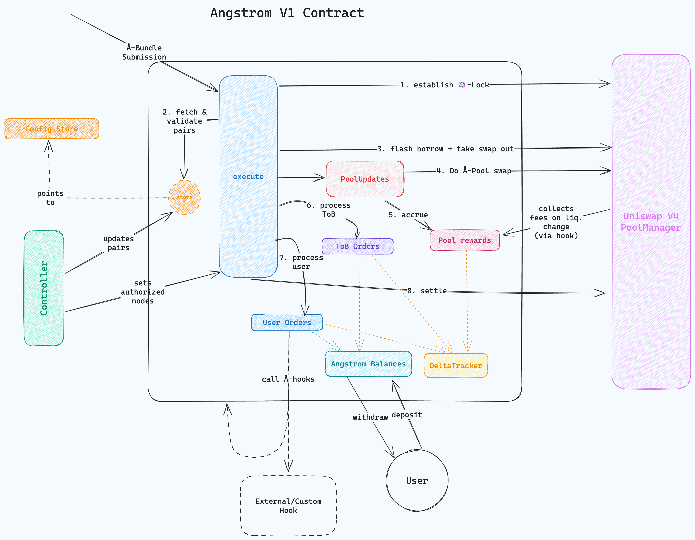

# Angstrom Contract Docs

To get started read the [Overview](./overview.md)

- [Bundle Building - What structs actually *mean* to the Angstrom contract & what functionality it triggers](./bundle-building.md)
- [Payload Types - The structs that Angstrom `execute` method expects](./payload-types.md)
- [PADE Encoding - The encoding format Angstrom uses to interpret the payload in `execute`](./pade-encoding-format.md)
- [Known Issues - Known, Low Severity / Non-Issues](./known-issues.md)
- [Pool Config Store](./pool-config-store.md)
- [Deployment instructions](./deployment.md)
- ["RAY" - What is Ray](./ray.md)

## Architecture

**Methods**

- `execute`:  Entrypoint for pool update, ToB + user order processing functionality & exact make up
  described in [`bundle-building`](./bundle-building.md) & [`payload-types`](./payload-types.md)
- `deposit`: Allows users to deposit funds into Angstrom for later trading (allows for gas savings
vs. ERC20 with allowance usage)
- `withdraw`: Counterpart to `deposit` allows users to take back funds
- `invalidateNonce`: Lets users invalidate "standing orders" by marking the associated nonce as used
