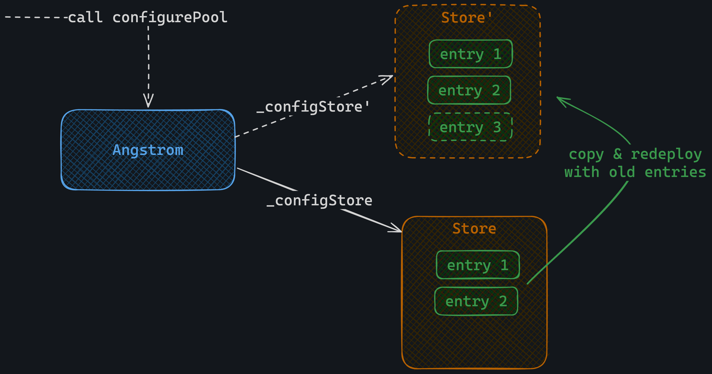
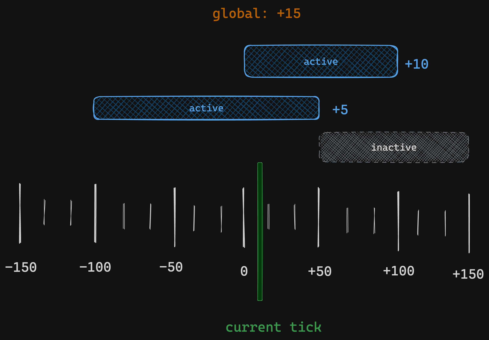
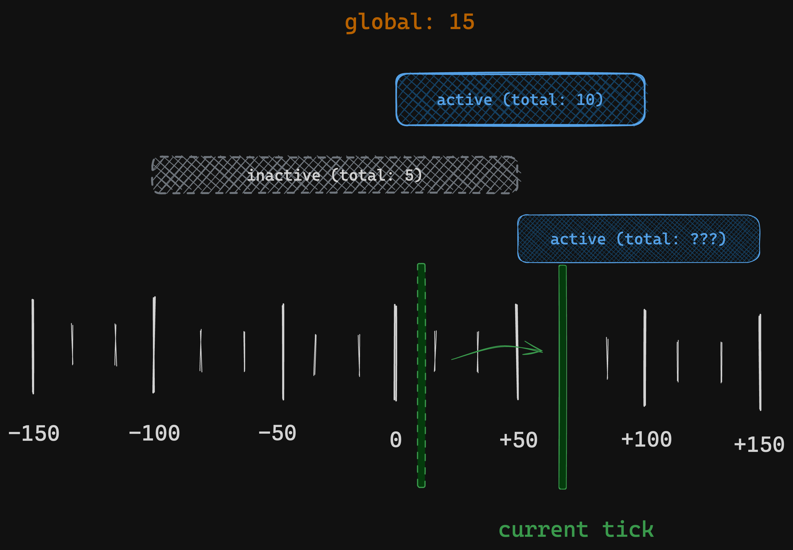
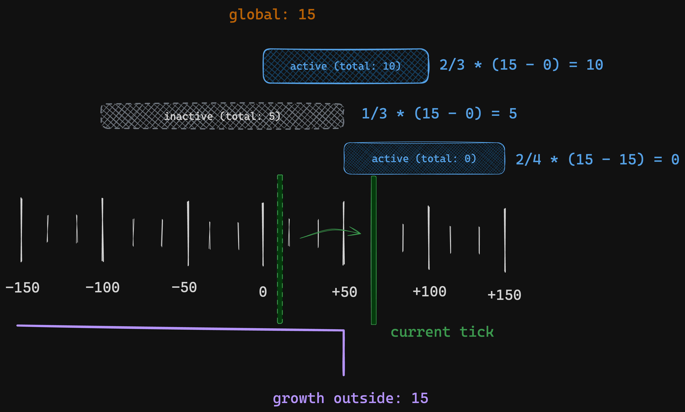
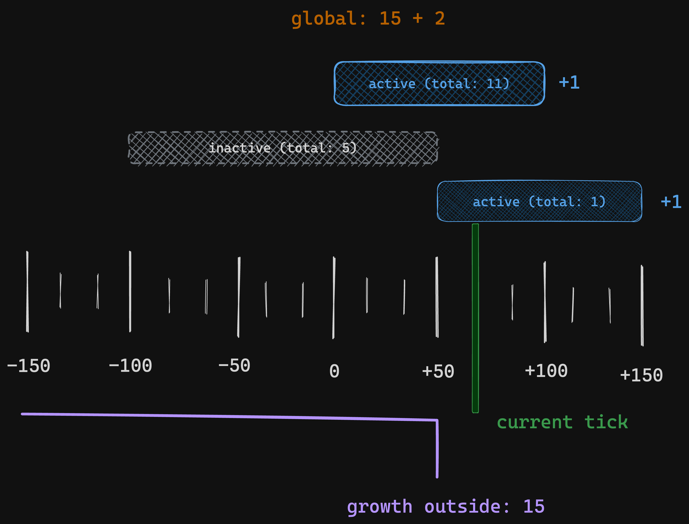
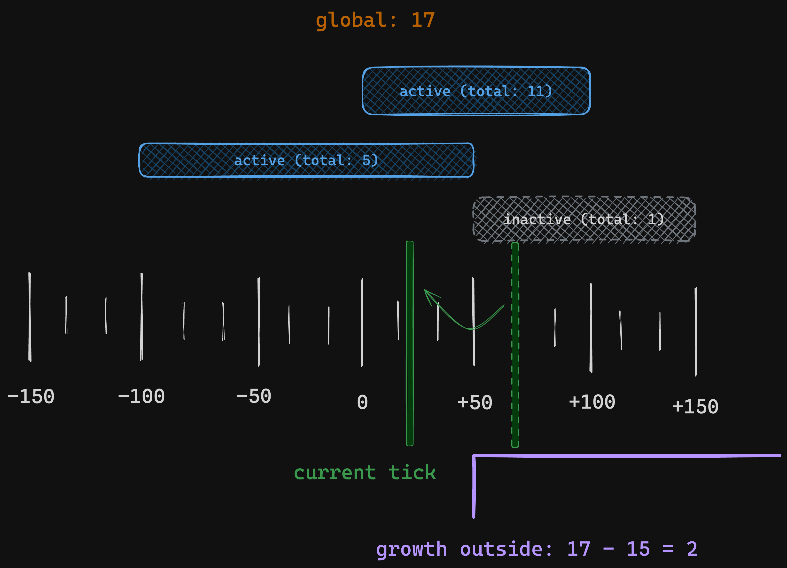
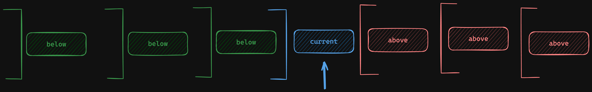

# Overview

## Angstrom

Angstrom as a whole is a trustless, hybrid AMM/Orderbook exchange that settles on Ethereum and aims
to mitigate MEV for users as well as LPs.

Now that's a whole word salad of buzzwords so let's break it down:
- **Trustless:** When considering the system as a whole one should not have to trust any central
party for the integrity of transactions and even more the quality of trade execution. At most one
must trust that a majority of well incentivized actors is operating in their best interest.
- **Hybrid AMM/Orderbook:** Angstrom is an orderbook, accepting and matching limit orders against
each other as well as an underlying AMM.
- **Settles On Ethereum:** Users are charged for and receive the result of their trades in an
immediately usable form on Ethereum L1.
- **Mitigates MEV:**
    - **For Users:** The network has mechanisms to limit censorship and clears all limit orders in
    batches at a common uniform price, guaranteeing that all users are treated _fairly_ and cannot
    easily be extracted from via e.g. sandwich attacks.
    - **For LPs:** The competition to extract MEV from the underlying AMM is internalized in the
    form of a "ToB (Top of Block) Auction" in which the proceeds are redistributed to the LPs to
    limit the value leakage from the being AMM being arbitraged.

## The Contracts

The contracts are split between "core" and "periphery". Where core is responsible for order
validation & settlement, underlying AMM reward management and store for user deposits. 

The periphery contracts (WIP 🚧) implement the finer details of acccess control, as well as managing
collection and distribution of node & referral fees.

### Assumptions

Provided is a list of assumptions that the on-chain components operate under, expecting that these
will be upheld/enforced via the off-chain, staked Angstrom network.

- **Economic security assumption:** When behaving as rational actors the design of the Å-Network
guarantees censorship resistance & correct order matching.
- **Sufficiently staked assumption:** All Å-Nodes have provided a stake such that should they
submit the worst possible bundles ("worst" classified as a non-reverting bundle where the maximal value is
extracted from users via e.g. worst-case trade execution) for the longest possible time, the
slashing amount & kicking period will ensure that any user losses can be compensated via the
slashed stake.
- **Well behaving routers:** Users will use sound routers to add & remove
liquidity. A malicious router could steal rewards distributed in the beforeRemoveLiquidity hook.
- **No fee-on-transfer/rebase tokens:** The controller will only whitelist tokens that transfer the
  exact amount specified upon successful `transfer` calls and that token balances do not on their
own *decrease* over time.
- **Environment is canonical L1 Ethereum:** The `Angstrom` contracts will only be deployed to the
Ethereum L1 Mainnet or canonical testnets with identical semantics.
- **The `_controller` is sound:** The controller will maintain the approved set of nodes such that
the _economic security assumption_ and _sufficiently staked assumption_ is maintained over time.
Furthermore is will trustlessly verify that `pullFee` is only ever called for unclaimed amounts that
have been committed to for later claiming via the fee summary events.
- **Integrity of state dependencies:** Running off-chain the nodes of the Angstrom network expect to
  be tightly coupled with builders meaning roughly it can expect that *most of the time* the way it
  sees the chain will be the state when a bundle lands. This means that we assume DoS vectors from
  modifying state dependencies e.g. ERC20 permits, token balances or hooks will be managed well.
- **Fair Referral & Gas Fees:** The staked node will set the `gasUsedAsset0` / `extraFeeAsset0` such
  that it fairly reflects that orders share of gas use in the bundle & any referral fee it may have
  opted into by setting a **non-zero** `refId` 

For more assumptions / known issues see [known-issues](./known-issues.md).

### Core

The main job of the core contract is to take in a Å-Node supplied bundle, decode, validate and
execute it. In an effort to save gas the contract relaxes its trust assumptions in certain areas,
relying on the economic security guarantees provided by the off-chain set of Angstrom nodes.

The below paragraphs give an overview of different important parts & concepts in Angstrom:

### Node vs. Users

Trusted, staked nodes as described above are the ones responsible for calling `execute` and
providing some of the parameters for orders. Assets, prices, `amountFilled` for partial orders and
`gasUsedAsset0` / `extraFeeAsset0` are all computed and supplied by the trusted node.

Users supply their orders/intents in the form of `src/_reference/SignedTypes.sol`. The node performs
order matching determining which ToB & user orders to include as well as what amount to fill for
partial orders. The node is also responsible for computing and fairly splitting gas & referral fees
among users.

#### The `execute(bytes)` Entry Point

The `Angstrom::execute` method is the entry point for bundle execution, it calls into the Uniswap V4
position manager to establish a lock so that it can execute pool swaps & settle swap deltas.

The execute takes a [PADE-encoded](./pade-encoding-format.md) payload specified in [./payload-types.md](./payload-types.md).

Bundle processing proceeds in the following stages:
1. Load & validate list of assets
2. Load & validate list of pairs for that bundle
3. Take tokens from Uniswap (either to settle swap deltas or as flashloan for settling orders).
4. For each pool: update
    1. Execute a swap against the underlying Uniswap pool
    2. Update pool reward accumulators to account for new rewards & tick crossings
5. Validate & execute ToB (top of block) orders
6. Validate & execute user orders
7. Settle remaining deltas with Uniswap
8. Emit collected fee summary event

#### Intra Bundle Accounting

To ensure the contract remains solvent the [`DeltaTracker`](../src/types/DeltaTracker.sol) keeps
track of net balance changes for every asset and is checked at the end.

The _solvency_ invariant it maintains for every asset $\alpha$ is:
```math
\text{TotalTokenBalance}_{\alpha}=\text{Delta}_{\alpha} + \sum^N_i \text{UserBalance}_{i,\alpha} + \sum^N_i \text{LPReward}_{i,\alpha}
```

Here a visualization of how each action in a bundle is accountd for:


A component of general solvency that the core contract does not directly guarantee is amounts
related to limit order fees (fees accrued via `feeInE6` & `maxExtraF`).

#### Pool Config Store

To keep track of which pairs have been enabled and what parameters to use for the underlying pool
the `Angstrom` contract maintains the _Pool Config Store_. To save gas on batched reads the "code as
storage" aka _SSTORE2_ pattern is employed. Instead of using say a normal mapping to keep track of
the enabled pools and their parameters the data is instead stored as a list in the form of contract
bytecode.

This is because reading a single cold storage slot costs 2100 gas and holds 32 bytes while
reading the code of a cold contract costs 2600 gas, **but** can hold up to 24576 bytes. This does
come with the tradeoff that updating/adding new pools is quite expensive, which is a worthy trade
off since generally >1 pair / bundle is expected & updating the config should be relatively
infrequent.



#### Pool Rewards

Angstrom internally uses "growth outside" accumulators to track and account for LP rewards very
similar to the way Uniswap V3+ fee accumulators function. The goal of this system is to be able to
efficiently update & compute rewards to be distributed to ranged positions *without* needing to
iterate across entire ranges.

The reward tracking consists of two accumulators:
- a global reward growth accumulator
- a per-tick "growth outside" accumulator

**Global Reward Accumulator**

Any accrued rewards get added to the global accumulator and represent the rewards accrued by
*active* positions, position's whos tick range contains the current tick:




As the current tick moves around and leaves one range into another we want to keep track of the fact
that the accrued rewards *should not* count towards the rewards for ranges that were previously
active. This is where the "growth outside" accumulators come in:



**Reward Growth Outside Accumulators**

To ensure we don't double count rewards we update a growth outside accumulator whenever we cross a
tick such that it represents the sum of rewards accrued in the direction away from the current tick:



Now we continue to update the global reward growth as usual whenever we distribute new rewards:



Generalizing the update of the growth outside value at tick boundaries we simply do `growth_outside'
:= global_growth - growth_outside`:



Notice that as current tick moves and positions become inactive/active the amount of active
liquidity will change. To ensure that the rewards tracking remains consistent despite this the
accumulators do not track the absolute growth in rewards but instead the growth per unit of
liquidity.

As rewards accumulate and the current tick moves back and forth you end up with growth outside
accumulators looking like this:



The brackets representing the range for which the growth outside value is the sum *relative* to the
current tick. Notice the discrepency between the meaning of the growth outside accumulators for
ticks *below or at* the current tick and *above* the current tick. Below or at the curren tick the
growth outside range is **exclusive**, above it is **inclusive**.

When rewarding multiple ranges in one go as in Angstrom one must consider this asymmetry when
handling the above and below cases.

#### Gas Payment & Extra Fee

To ensure users trading on Angstrom don't have to think about ETH-denominated gas payments gas is
charged in either the input/output asset of the respective trade.

On top of this users may be charged a referral fee if they opted into one via a referral tag
(`ref_id` field). Validating the ref id, retrieving the fee rate and applying it correctly is the
responsibility of the nodes. They will use a registry in the periphery contracts as their source of
truth.

The total gas fee + referral fee is called the "extra fee" and is charged in the respective `asset0`
of the pair.
