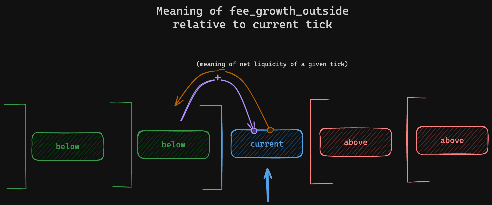

# Angstrom Payload Struct Specification

**Corresponding Source file:** [`Angstrom.sol`](../src/Angstrom.sol)

## Overview

The `Angstrom` contract is the core entry point for nodes submitting bundles of orders. The contract
is in charge of:
- validating orders (signatures, nonces, limits)
- settling orders
- enforcing key protocol invariants
    - uniform clearing (all orders for the same pair get the same price)
    - only active nodes are allowed to submit bundles
    - there may only be 1 bundle / block
- interacting with Uniswap V4
    - swapping against Angstrom pools
    - transferring tokens between Uniswap and itself
    - flash borrowing from Uniswap to ensure orders can be filled

Note that the protocol only enforces *some* protocol invariants and leaves others to the economic
security of the nodes to save on gas e.g. checking that prices are consistent across alternative
pairs.

The main entry point for submitting a bundle to the `Angstrom` contract is the `execute(bytes)`
method which takes the encoded bundle.

## Bundle specification & `execute(bytes)`

**Entry-point Control Flow**

When `execute` is called all it does is authenticate that the caller is a node before calling into Uniswap's
`unlock` function which in turn calls **back into** the `Angstrom` contract passing it the original
payload as `data` (this back and forth is required because it establishes a call context from which
we're allowed to actually interact with Uniswap at all).

### Shared Structs & Types

#### `Signature`


```rust
enum Signature {
    Contract {
        from: address,
        signature: List<bytes1>
    },
    Ecdsa {
        v: uint8,
        r: bytes32,
        s: bytes32
    }
}
```

The `Signature` enum represents either an EOA ECDSA signature or a smart contract signature. Ecdsa
signature do not need the signer address specified as the signer can be recovered as part of the
signature validation process.

### Bundle contents

The bundle is a struct encoded using the [PADE format](./pade-encoding-format.md). The string of bytes is the
value that the `execute` method is called with (not that the call itself is still ABI encoded, just
the contents of the single `bytes` parameter itself is PADE).


#### Top-level Payload Contents (the `Bundle` struct)

The `data` payload is the PADE encoding of the following struct:

```rust
struct Bundle {
    assets: List<Asset>,
    pairs: List<Pair>,
    pool_updates: List<PoolUpdate>,
    top_of_block_orders: List<TopOfBlockOrder>,
    user_orders: List<UserOrder>,
}
```

|Field|Description|
|-----|-----------|
|`use_store: bool`| Whether to use storage or the store for retrieving pool configs. |

#### `Asset`

Solidity: [decoding implementation](../src/types/Asset.sol) | [reference
encoding (`test/_reference/Asset.sol`)](../test/_reference/Asset.sol)

```rust
struct Asset {
    addr: address,
    save: u128,
    take: u128,
    settle: u128
}
```

The array of assets specifies what assets are going to be traded or settled in the submitted bundle.
The elements **must be** sorted in ascending order according the value of `.addr`.

|Field|Description|
|-----|-----------|
|`addr: address`|Contract address of ERC20 token of the asset. |
|`save: uint128`|Amount of the asset to save as the network fee (`.addr` base unit)|
|`take: uint128`|Amount of the asset to take from Uniswap (`.addr` base unit) |
|`settle: uint128`|Final amount to be repayed to Uniswap post-bundle execution. (`.addr` base unit)|

#### `Pair`

Solidity: [decoding implementation](../src/types/Pair.sol) | [reference
encoding (`test/_reference/Pair.sol`)](../test/_reference/Pair.sol)

```rust
struct Pair {
    index0: u16,
    index1: u16,
    store_index: u16,
    price_1over0: u256
}
```

This list of pairs defines the unique uniform clearing prices for the different pairs in the bundle.
The elements **must be** sorted in ascending order according to the tuple `(.index0, .index1)`.

Note that to ensure pair uniqueness `.index0` **must** be less than `.index1`.

|Field|Description|
|-----|-----------|
|`index0: u16`|Pair's asset 0 as index into the asset array|
|`index1: u16`|Pair's asset 1 as index into the asset array|
|`store_index: u16`|The pair's [store index](./bundle-building.md#Store-Index)|
|`price_1over0: u256`|Uniform clearing price of pair in asset 1 **over** asset 0 base units in Ray e.g. `13.2e27` represents 13.2 base units of 1 for every base unit of 0.|


#### `PoolUpdate`

Solidity: [decoding implementation](../src/modules/PoolUpdates.sol) | [reference
encoding (`test/_reference/PoolUpdate.sol`)](../test/_reference/PoolUpdate.sol)


```rust
struct PoolUpdate {
    zero_for_one: bool,
    pair_index: u16,
    swap_in_quantity: u128,
    rewards_update: RewardsUpdate
}
```

The array of `PoolUpdate`s represents intended changes to the underlying pool. This includes the
netted out swap to execute against the underlying Uniswap pool (where Angstrom is its hook) and
rewards to be saved & accounted for LPs. The contract does not enforce update uniqueness, it is
recommended to net out multiple swaps against the same pool into one to save on gas.

|Field|Description|
|-----|-----------|
|`zero_for_one: bool`|Whether the swap is asset0 => asset1 (`zero_for_one = true`) or the other way.|
|`pair_index: u16`|Index of the pair in the pair's list to retrieve the pool information from.|
|`swap_in_quantity: u128`|The swap input quantity in the input asset's base units.|
|`rewards_update: RewardsUpdate`| The pool's LP rewards to distribute *after* the pool swap is executed. |

##### Rewards Update

Solidity: [decoding implementation (`_decodeAndReward`)](../src/modules/GrowthOutsideUpdater.sol) | [reference encoding](../test/_reference/PoolUpdate.sol).

```rust
enum RewardsUpdate {
    MultiTick {
        start_tick: i24,
        start_liquidity: u128,
        quantities: List<u128>,
        reward_checksum: u160
    },
    CurrentOnly {
        amount: u128,
        expected_liquidity: u128
    }
}
```

The rewards update data informs the Angstrom contract where to begin the reward update loop and what
quantities to donate. The `::CurrentOnly` variant donates the specified amount to the current
tick (post-swap), the rest of this section describes the `MultiTick` variant. Which is required
whenever 1 or more ticks are being rewarded, or a single tick that is not the current tick. The
`start_liquidity` value informs the contract what the total liquidity is at the start as this
cannot be efficiently querried. Note that the value is eventually checked however and is computed
as the loop progresses to ensure consistency of reward distribution.


|Field|Description |
|-----|-----------|
|`start_tick: i24`| When `below = true` the current tick: the first tick **above** the first tick to donate to. <br> When rewarding above: just the first tick actually being donated to. |
|`start_liquidity: u128`|The current liquidity if the first tick to donate to were the current tick.|
|`quantities: List<u128>`|The reward for each initialized tick range *including* the current tick in
`asset0` base units.|

**Reward Update Internals**ß

To gain a better intuition over how parameters need to be set it's good to understand how the reward
update loop operates. The main purpose of the loop is to update the _internal_
`reward_growth_outside` value of the ticks it passes. The "growth outside" values represent
cumulative rewards in such a way where the total rewards accrued by a liquidity range can be
efficiently computed later.

To understand why rewarding above and below the current tick requires different starting values
we need to understand how the meaning of a tick's `reward_growth_outside` value changes
_relative to the current tick_:



For ticks that are **below or at** the current tick their `reward_growth_outside` value represents the sum
of all accrued rewards in the ticks below **excluding the tick's own rewards**.

Conversely for ticks that are above the current tick their `reward_growth_outside` value represents
the sum of all accrued rewards in the ticks above **including its own**.

Generally the logic for updating pool rewards looks as follows:

```python
def update_rewards(
    pool: Pool,
    start_tick: Tick,
    quantities: list[int],
    liquidity: int,
    expected_checksum: int,
    below: bool
):
    cumulative_reward_growth: float = 0

    end_tick: Tick = get_current_tick()
    ticks: list[Tick] = initialized_tick_range(start_tick, end_tick, include_end=below)
    reward_checksum: bytes32 = b'\x00' * 32

    for tick, quantity in zip(ticks, quantities):
        cumulative_reward_growth += quantity / liquidity
        tick.reward_growth_outside += cumulative_reward_growth

        if below:
            liquidity += tick.net_liquidity
        else:
            liquidity -= tick.net_liquidity

        reward_checksum = keccak256(abi_encode_packed(
            (reward_checksum, 'bytes32'),
            (liquidity, 'uint128'),
            (tick, 'int24')
        ))

    assert len(quantities) == len(ticks) + 1, 'Unused quantities'
    checksum_bits = int.from_bytes(reward_checksum, 'big') >> (256 - 160)
    assert checksum_bits == expected_checksum, 'Invalid checksum'

    current_tick_reward: int = quantities[len(ticks)]
    cumulative_reward_growth += current_tick_reward / liquidity
    pool.global_reward_growth += sum(quantities)

    assert liquidity == get_current_liquidity(), 'Invalid set start liquidity'
```


#### `TopOfBlockOrder`

Solidity: [decoding implementation (`_validateAndExecuteToB`)](../src/Angstrom.sol) | [reference encoding](../test/_reference/OrderTypes.sol).

```rust
struct TopOfBlockOrder {
    use_internal: bool,
    quantity_in: u128,
    quantity_out: u128,
    max_gas_asset0: u128,
    gas_used_asset0: u128,
    pairs_index: u16,
    zero_for_one: bool,
    recipient: Option<address>,
    signature: Signature
}
```

|Field|Description|
|-----|-----------|
|`use_internal: bool`|Whether to use angstrom internal balance (`true`) or actual ERC20 balance (`false`) to settle|
|`quantity_in: u128`|The order offered input quanity in the input asset's base units.|
|`quantity_out: u128`|The order expected output quantity in the output asset's base units.|
|`max_gas_asset0: u128`|The maximum gas the searcher accepts to be charged (in asset0 base units)|
|`gas_used_asset0: u128`|The actual gas the searcher ended up getting charged for their order (in asset0 base units)|
|`asset_in_index: u16`|Order's input asset as index into the assets array|
|`asset_out_index: u16`|Order's output asset as index into the assets array|
|`recipient: Option<address>`|Recipient for order output, `None` implies signer.|
|`signature: Signature`|The signature validating the order.|

#### `UserOrder`

```rust
struct UserOrder {
    ref_id: u32,
    use_internal: bool,
    pair_index: u16,
    min_price: u256,
    recipient: Option<address>,
    hook_data: Option<List<bytes1>>,
    zero_for_one: bool,
    standing_validation: Option<StandingValidation>,
    order_quantities: OrderQuantities,
    max_extra_fee_asset0: u128,
    extra_fee_asset0: u128,
    exact_in: bool,
    signature: Signature
}

struct StandingValidation {
    nonce: u64,
    deadline: u40
}

enum OrderQuantities {
    Exact {
        quantity: u128
    },
    Partial {
        min_quantity_in: u128,
        max_quantity_in: u128,
        filled_quantity: u128
    }
}
```

**`UserOrder`**

|Field|Description|
|-----|-----------|
|`ref_id: uint32`|Opt-in tag for source of order flow. May opt the user into being charged extra fees beyond gas.|
|`use_internal: bool`|Whether to use angstrom internal balance (`true`) or actual ERC20 balance (`false`) to settle|
|`pair_index: u16`|The index into the `List<Pair>` array that the order is trading in.|
|`min_price: u256`|The minimum price in asset out over asset in base units in RAY|
|`recipient: Option<address>`|Recipient for order output, `None` implies signer.|
|`hook_data: Option<List<bytes1>>`|Optional hook for composable orders, consisting of the hook address concatenated to the hook extra data.|
|`zero_for_one: bool`|Whether the order is swapping in the pair's `asset0` and getting out `asset1` (`true`) or the other way around (`false`)|
|`standing_validation: Option<StandingValidation>`|The one-time order validation data. (`None` implies a flash order which is validated via the block number)|
|`order_quantities: OrderQuantities`|Description of the quantities the order trades.|
|`max_extra_fee_asset0: u128`|The maximum gas + referral fee the user accepts to be charged (in asset0 base units)|
|`extra_fee_asset0: u128`|The actual extra fee the user ended up getting charged for their order (in asset0 base units)|
|`exact_in: bool`|For exact orders: whether the specified quantity is the input or output (disregarded for partial orders).|
|`signature: Signature`|The signature validating the order.|

**`StandingValidation`**
|Field|Description|
|-----|-----------|
|`nonce: u64`|The order's nonce (can only be used once but do not have to be used in order).|
|`deadline: u40`|The unix timestamp in seconds (inclusive) after which the order is considered invalid by the contract. |
