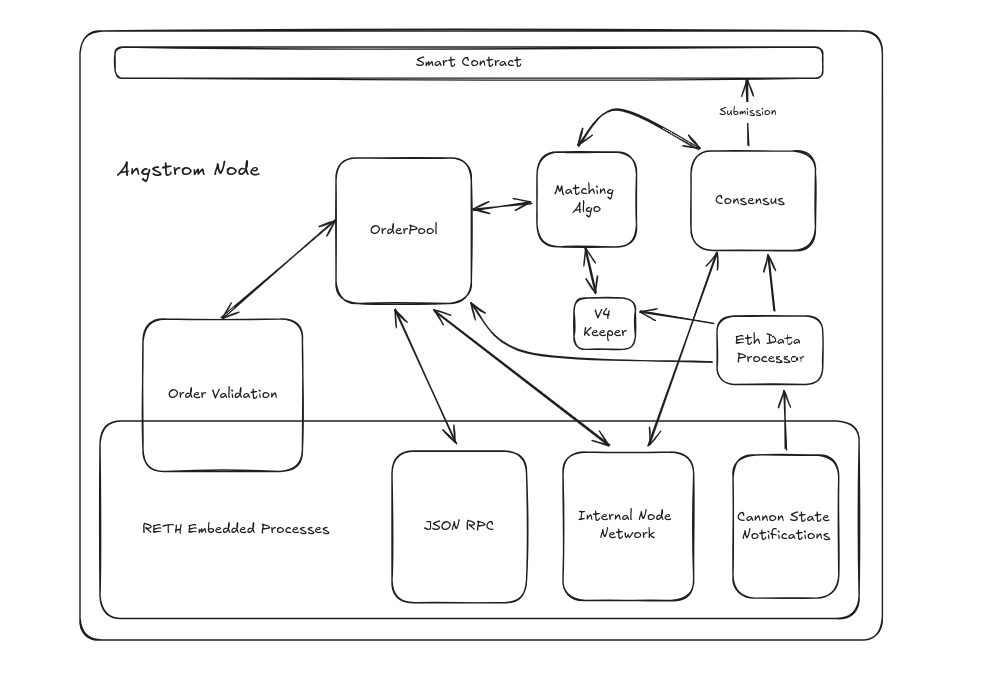

# Angstrom Node.
These docs cover the implementation spec and design of the angstrom node.

# Drawings
For every drawing of the specific modules. Each node represents a Struct. 
Any child node of a given node is a field in the parent struct.

# Sections
- [**Validation**](./validation/Overview.md)
- [**Order Pool**](./order-pool/Overview.md)
- [**Uniform Clearing**](./uniform-clearing/Overview.md)
- [**Network**](./network/Overview.md)
- [**Consensus**](./consensus/Overview.md)
