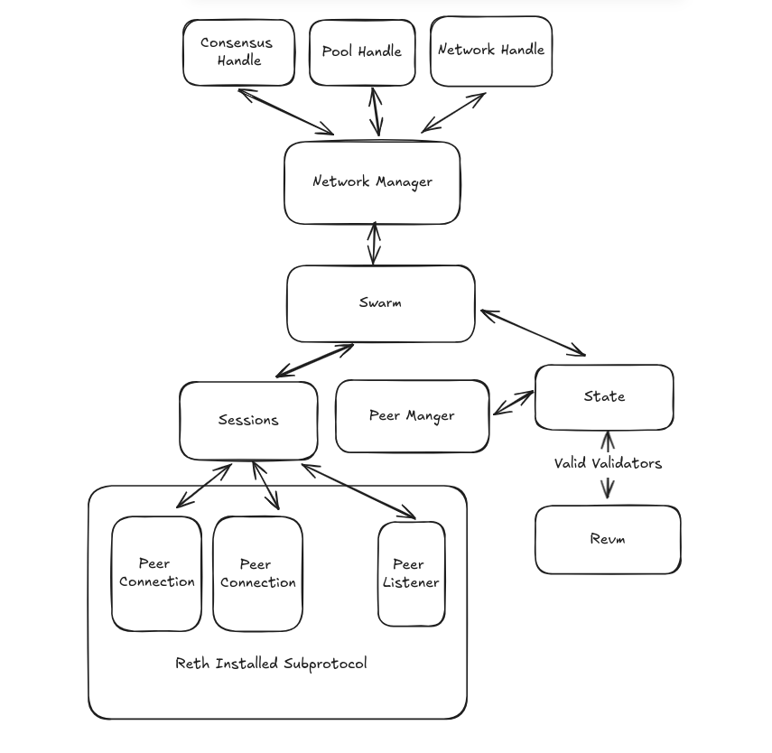

# Network

# Manager
The network manager facilitates the communication of order and consensus data between modules.

## Swarm
The swarm deals with message dispatch allong with peer tracking and is just a middle struct that acts as a
seperator to the manager
## State
The state tracker, tracks the state of the network and contains the set of valid validators. The state tracker is
in charge of making sure that we always know who is a validator. The state tracker also hold the peer manager, which
is just a behavior rating system for each peer so that we can monitor and possible disconnect from any missbehaving peer.
## Sessions.
The Sessions manager deals with handling new sessions along with propagating messages to the sessions.
