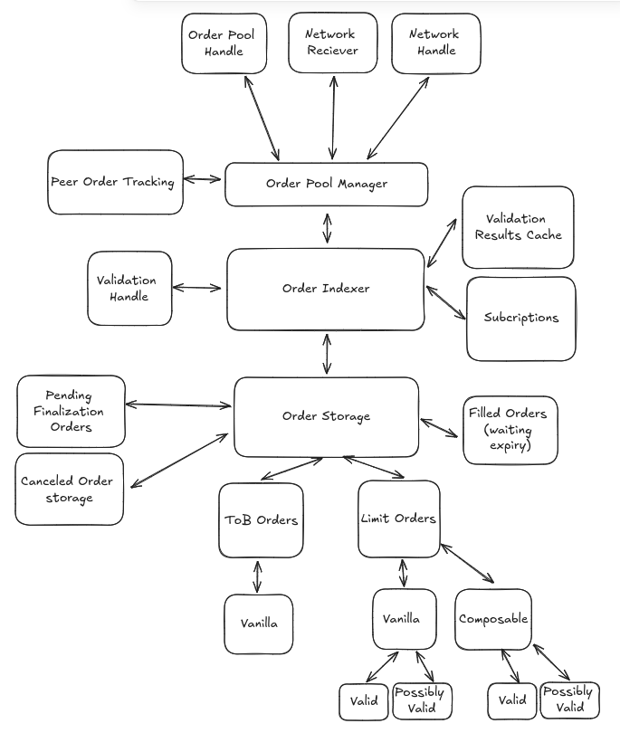

# Order Pool 

# Order Pool Manager
The Order pool manager facilitates the communication of order data between modules. 
##  Peer order tracking
Peer order tracking simply tracks what orders a given peer has sent to us to avoid
wasting network resources.
# Order Indexer
The Order Indexer is the heart of the order pool. This controls the movement of orders via incoming information from the manager,
The indexing of orders. Handling of subscriptions to order's. As well as the order lifecycle.
# Order Storage
The order storage as the name suggests, is the place in which verified and indexed orders are stored as well as canceled and filled orders for
the remainder of their life-cycle.

