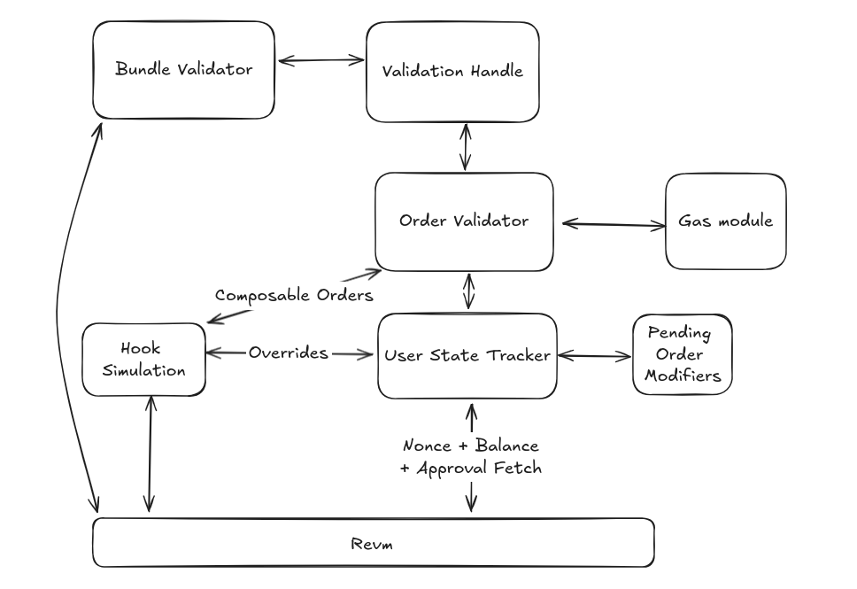

# Order Validation

# Module Uses
This goes over the specific uses of each module.
## Order Validator
The Order validator struct acts as the holder and dispatcher for the different
tools that are used for validating an order.
### Gas Module
Gas module is currently in the works but will have the calculations that are needed in order to see how a order fairs on gas.
This will include simulations on the specific execution parts of a given order
### Hook Simulation
The hook simulator is for simulating the hooks to make sure that they don't invalidate any state.
### User State Tracker
The User state tracker contains the state of a users account Nonces, Balances and Approvals. The User state tracker
also stores all current user pending orders (sorted by nonce) to enable multiple orders on same tokens for a given bundle.

## Bundle Validator
Used for calculating the bundle gas cost. Simply simulates the bundle at the top of the block and will let us know if bundle 
reverts + how much gas the bundle used
